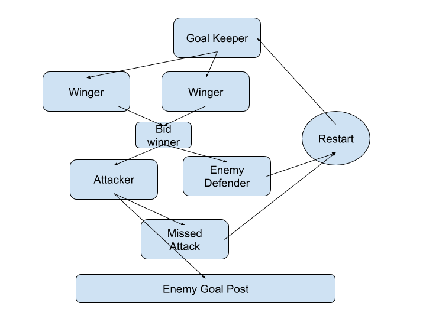
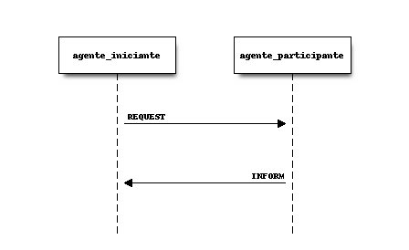
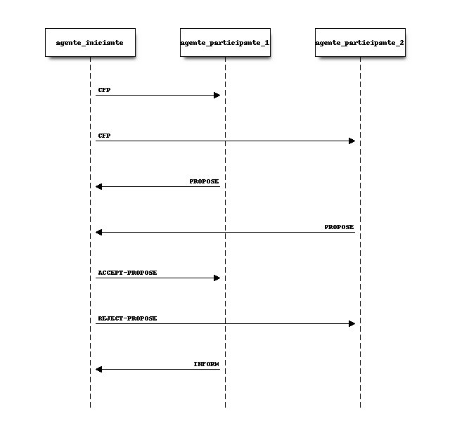
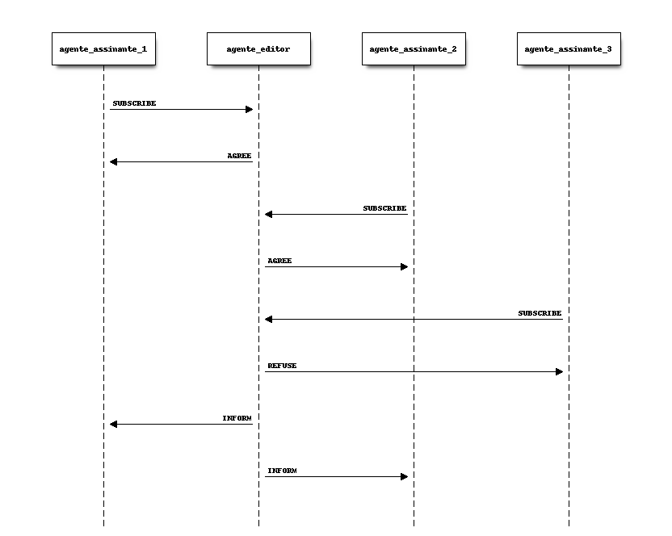
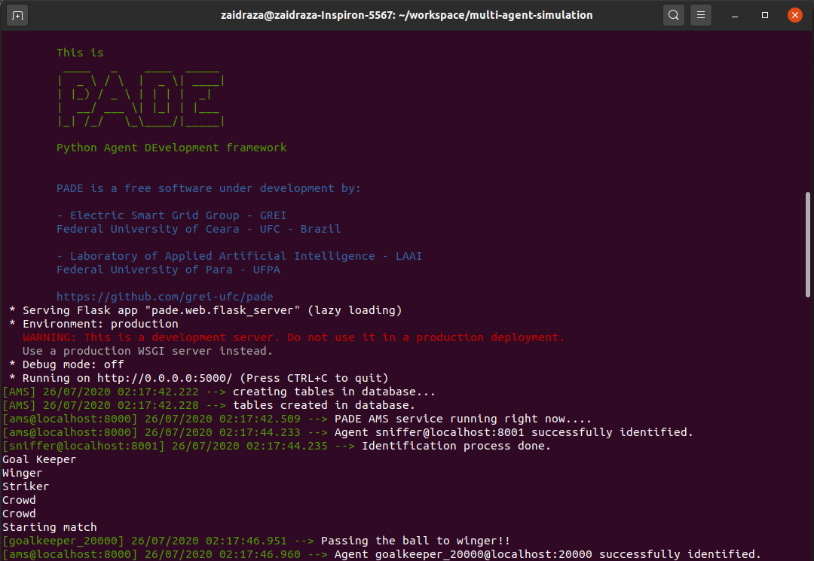
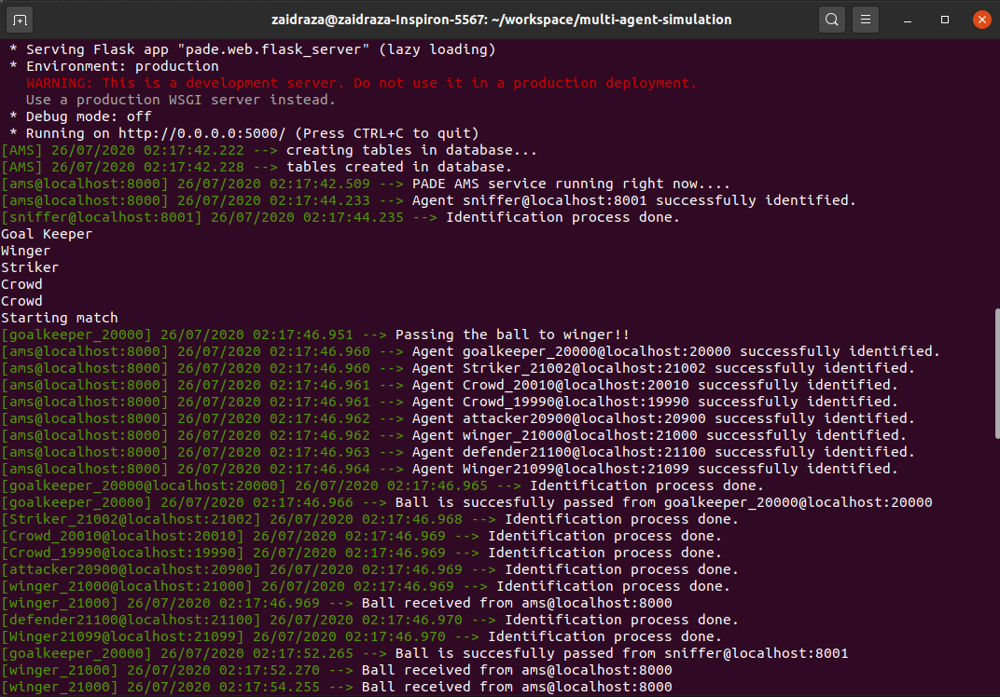
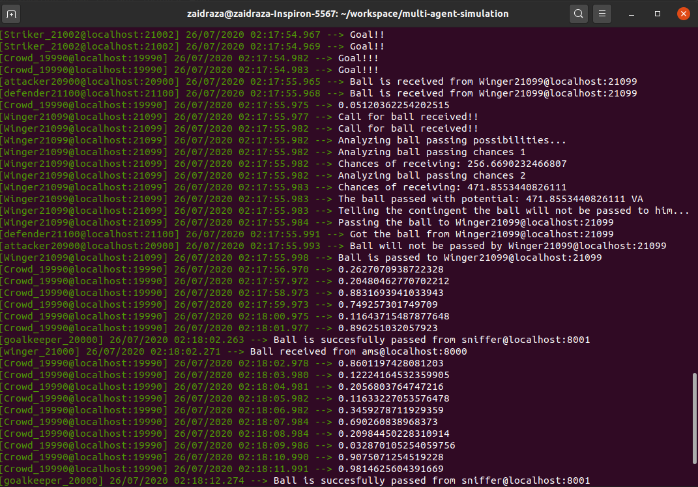
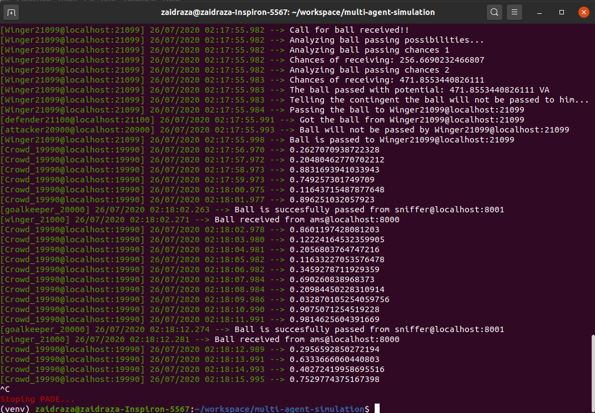

<h3>Collaborators:</h3>
<ul><li>Pravendra Singh Khichi</li>

<li>Zaid Khan</li>
</ul>

<h1 align="center">Soccer Multi-Agent Simulation</h1>

**24th July 2020**

<h1>OVERVIEW</h1>

A soccer game is a specific but very attractive real-time multi-agent environment. In a game, we have two competing teams. Each team has a team-wide common goal, namely to win the game. The goals of the two teams are incompatible. The opponent team can be seen as a dynamic and obstructive environment, which might disturb the achievement of the common team goal. To fulfill the common goal, each team needs to score, which can be seen as a subgoal. To achieve this subgoal, each team member is required to behave quickly, flexibly, and cooperatively; by taking local and global situations into account. The team might have some sorts of global (team-wide) strategies to fulfill the common goal, and both local and global tactics to achieve subgoals.

<h1>GOALS</h1>

1. Agent architecture
2. Control collaboration protocol
3. Behaviors of each model
4. Simulation in dynamic action 

<h1>SPECIFICATIONS OF SOCCER GAME</h1>

For this project, we will be using the python agent development environment(PADE). It used object-oriented programming concepts with communication through message passing. It also uses a flask to get information about the agents running on the server on port 5000.

<h1>DESIGN</h1>

This design is a simple CLI based design where the soccer is simulated with communication between agents through FIPA protocol. We have different agents to deliver different behaviors in the environment. The following are the agents in the environment:

1. Attacker
2. Defender
3. Winger
4. Goalkeeper

All the agents have different behavior which includes passing the ball, attacking the goal post, and defending the goal. For this the agents use different protocols. For example, goalkeeper uses request-response behavior to pass the ball to winger. Then winger uses bidding protocols for passing the ball with possibility that the ball can be intercepted by the defender. If the defender gets the ball then the game will restart. Otherwise, the ball will be passed to attacker. If attacker scores a goal then it notifies every other agent by using the subscribing protocol. If it fails then again the game will start

 

<h1>PLANNING SCHEME</h1>

<h2>World/Environment</h2>

For the simulation purpose, we are using PADE which is a framework for python for development, execution, and management of MAS(multi-agent systems) environments of the distributed computation. It uses the most popular FIPA standard protocols, like ContractNet, Request, and Subscribe.

The core package consists of basically an agent (has the necessary functionalities for defining an agent and to enable AMS registration, connection verification, and message exchange), an AMS system (for the purpose of communicating), and behavior. 

<h2>Agent Architecture</h2>

The Agent Model is composed of a connection mechanism to the platform, a message dispatcher, and a set of different behaviors that the dispatcher gives the messages to. 

Each PADE agent has an internal message dispatcher component. This message dispatcher acts as a mailman: when a message for the agent arrives, it places it in the correct “mailbox” (more about that later); and when the agent needs to send a message, the message dispatcher does the job, putting it in the communication stream. The message dispatching is done automatically by the PADE agent library whenever a new message arrives or is to be sent.

The agent is nothing but a model or actor for our simulation which is responsible for doing the actions in the simulated environment. These are the following agents that we will be having in our design:

GoalKeeper: Its responsibility is to start the soccer game. It passes the ball to one of the team members randomly.

Defender: The task is to take the ball by bidding to the opponents. The bid generated is random. If the bid is enough then it fetches the ball from the opponent and the game starts again.

Winger: The responsibility of winger is to pass the ball to the attacker, where there is a possibility of interception of the ball by an opponent player. So with a probability, it passes the ball to the team.

Attacker: The attacker agent is responsible for attacking with a certain probability. If it scores then everyone will celebrate. And if it fails then the match will start again from the goalkeeper agent.

<h2>Behaviors</h2>

An agent can run several behaviors simultaneously. A behavior is a task that an agent can execute using repeating patterns. PADE provides some predefined behavior types: Timed behavior, bidding behavior, publisher-subscriber behavior. Those behavior types help to implement the different tasks that an agent can perform. 

Every agent can have as many behaviors as desired. When a message arrives at the agent, the message dispatcher redirects it to the correct behavior queue. The behavior has a message template attached to it. Therefore, the message dispatcher uses this template to determine which behavior the message is for, by matching it with the correct template. Behavior can thus select what kind of messages it wants to receive by using templates.

The following are the behaviors we are going to use in our design:

Passing behavior: Between members of the same team. It’s just a request-response behavior between the same teams.

Publisher-Subscriber behavior: To notify others that the ball is received, and passed to some other members.

Bidding behavior: To call out for the ball to team members bidding is necessary. Through which defender and attacker will get the ball. 

<h2>Control Collaboration Protocol: FIPA</h2>

The FIPA-Request protocol is used when you need to make a request for something to other agents.

The FIPA-Contract-Net protocol is used for situations where it is necessary to carry out some type of negotiation between agents. In the same way as in the FIPA-Request protocol, in the FIPA-ContractNet protocol, there are two types of agents, an agent that initiates the negotiation, or a beginning agent, making requests for proposals and one or more agents that participate in the negotiation, or participating agents, that respond to the initiating agent's requests for proposals.

The FIPA-Subscribe protocol implements the behavior of editor-subscriber, which consists of the presence of an editor agent who can accept the association of other interested agents, subscribing agents, in some type of information that this agent has, subscribing to the information and receiving message whenever this information is made available by the publishing agent.

<h1>SIMULATION</h1>

<h1>HOW TO RUN THE CODE:</h1>

Install the dependencies by pip3 install -r requirements.txt

Then for running the code run: pade start_runtime --port 20000 driver.py
